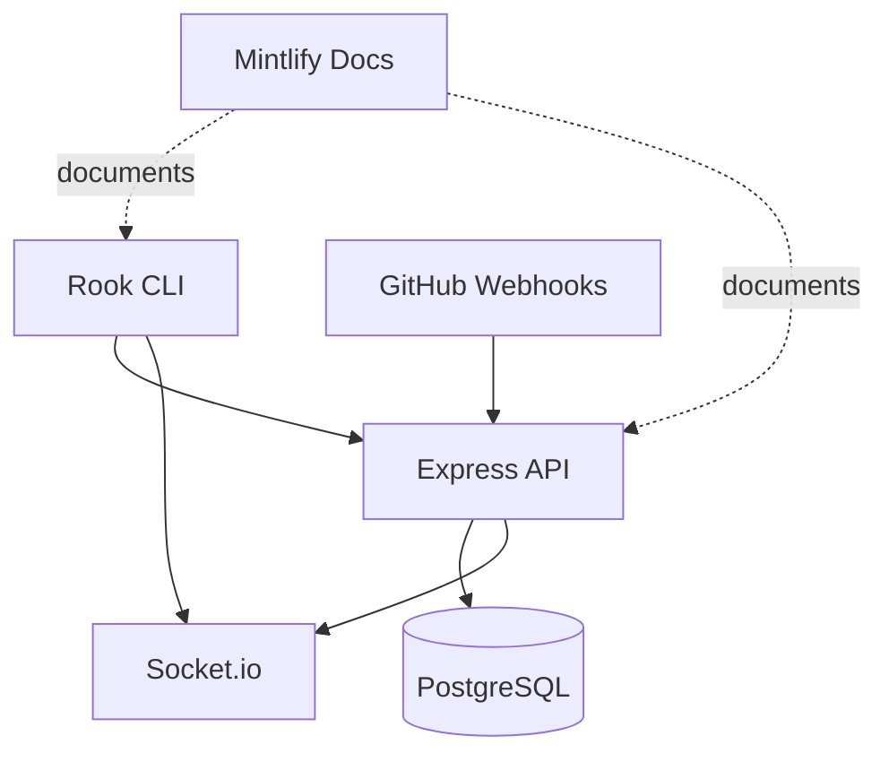

# System Architecture

## High-Level Topology

## Main Runtime Entry Points

| Path | Role |
|------|------|
| `src/index.ts` | Registers all Commander commands |
| `src/lib/api.ts` | Axios client for the backend |
| `backend/server.js` | Express bootstrap, Socket.io bootstrap, seeding, route mounting |
| `backend/webhooks/github.js` | GitHub event ingestion and XP awarding |
| `backend/routes/*.js` | User, quest, social, guild, webhook, notification, and crafting routes |
| `docs/docs.json` | Mintlify site structure |

## Backend Composition

### HTTP routes

- `/api/users/*`: registration, stats, XP, activity, loot, prestige, friends, share
- `/api/leaderboard/global`: global rankings
- `/api/github/webhooks`: GitHub webhook installation helper
- `/api/webhooks/github`: GitHub event receiver
- `/api/crafting/*`: recipes and crafting
- `/api/guilds/*`: guild lifecycle and guild quests
- `/api/notifications/*`: Slack and Discord integrations
- `/api/health`: health check

### Realtime events

- `leaderboard:update`
- `loot`
- `craft`
- `battle:update`
- `battle:win`

## Data Model Snapshot

Core tables created by `backend/schema.sql` and migrations include:

- `users`
- `user_stats`
- `daily_quests`
- `xp_activity`
- `friendships`
- `achievements`
- `user_achievements`
- `loot_items`
- `loot_drops`
- `crafting_recipes`
- `crafting_recipe_ingredients`
- `guilds`
- `guild_members`
- `guild_invites`
- `guild_quests`
- `prestige_resets`

## Progression Pipeline

1. GitHub sends an event to `/api/webhooks/github`.
2. The webhook handler maps the sender to a Rook user via `github_id`.
3. The backend computes base XP for the event type.
4. `applyXpWithBonuses` multiplies XP by quest streak, guild, and prestige modifiers.
5. The progression layer persists XP and emits `leaderboard:update`.
6. Loot, quest completion, quest-streak drops, prestige drops, and PR battle updates can emit follow-on Socket.io events.

## CLI Composition

The CLI is intentionally thin:

- command handlers orchestrate prompts and rendering
- `src/lib/api.ts` owns transport
- `src/lib/config.ts` owns local config persistence
- `src/lib/xp.ts` owns local-only display math like progress bars and titles

That split makes the backend the source of truth for progression while the CLI focuses on user experience.

## Operational Caveats

<AccordionGroup>
  <Accordion title="Most REST routes trust the caller">
    The current backend has no shared auth middleware. The CLI sends an `Authorization` header, but the route layer generally does not validate it.
  </Accordion>
  <Accordion title="Webhook verification is optional">
    Signature verification only becomes active when `GITHUB_WEBHOOK_SECRET` is set.
  </Accordion>
  <Accordion title="Some CLI flows depend on backend-derived state">
    Crafting recipes, guild summary, prestige summary, and recent loot are all pulled from backend responses rather than recomputed client-side.
  </Accordion>
</AccordionGroup>
